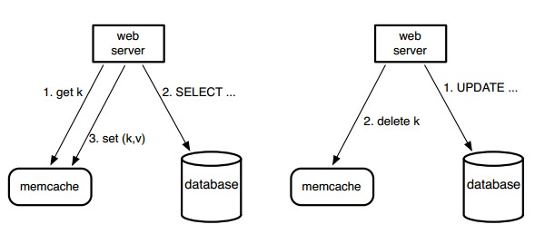
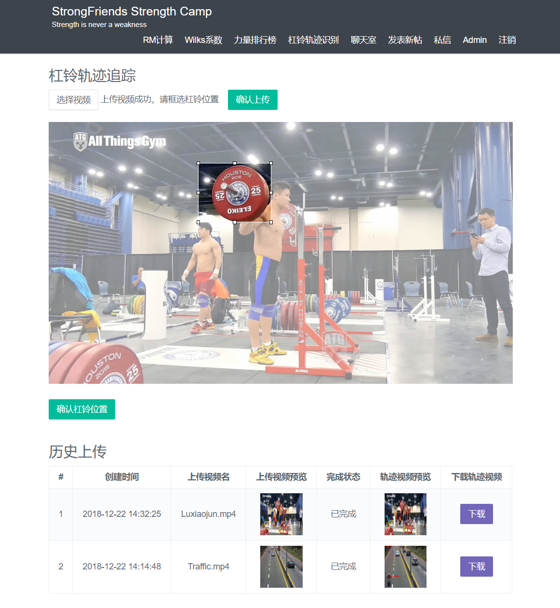

# StrongFriends

## 关于 StrongFriends

StrongFriends，又称壮壮朋友(๑•̀ㅂ•́)و✧，是一个基于 Spring Boot 与 Flask 开发的专注于举铁爱好者的论坛。

> Strength is never a weakness.
> Weakness is never a strength. 

## 功能

- 发帖
- 评论
- 点赞
- 私信
- TODO 聊天室 （基于 Netty）
- RM / Wilks 系数计算
- 力量排行榜
- 杠铃轨迹识别（基于OpenCV3）
- 论坛管理

## 说明

###  Interceptor 的使用

- 用户登录（配合 Token 进行校验将用户信息放入 ThreadLocal 中方便后续调用）
- 权限控制 （判断是否可以进入管理页面）

### Filter 实现 HTML 转义

主要目的是为了防止 XSS 攻击，实现方式：

1. 实现 XssHttpServletRequestWrapper 类，继承自 HttpServletRequestWrapper，重写 getParameter() 和 getParameterValues() 方法，使用 org.apache.commons.lang3 下的 StringEscapeUtils.escapeHtml4() 方法对所有请求参数与 JSON 进行转义。
2. 实现 Fliter 过滤所有请求，将 HttpServletRequest 强转为 XssHttpServletRequestWrapper 传递下去

### 异步服务通用模块

这个模块的核心基于生产者-消费者模型，生产者通过向 MQ（由 Redis list 实现，是 FIFO 的）中 Push 需要处理的事件，然后消费者将事件弹出并通过线程池消费。

其中，生产者产生的事件类型是多样的，消费者需要判断事件类型并调用对应的 Handler 处理。

分为以下五个部分：

- EventModel (Event class)
- EventType (This class marks the type of events)
- EventHandler (A common class to handle events)
- EventProducer (Every single request will be pushed to the queue)
- EventConsumer (Consumer will generate a thread pool to consume the events in the queue with infinite loop)

### Redis

只在赞 / 踩与评论功能中使用了 Redis 作为缓存。

#### 赞 / 踩服务中的 Redis 使用

- 写：Redis
- 读：Redis
- 注：考虑到赞踩是热点数据，弱数据一致性，只需要将 Redis 缓存定时写入 MySQL 就好。
- Redis 缓存定时写入 MySQL：使用 `@EnableScheduling` 注解来开启定时任务。
- 即使 Redis 崩了，也能从 MySQL 中恢复上一次的数据，且赞踩数据不是很重要。

### 评论服务中的 Redis 使用

这部分参考了论文《Scaling Memcache at Facebook》 中的 **Query cache** 策略：

> We rely on memcache to lighten the read load on our databases. In particular, we use memcache as a demand-filled look-aside cache as shown in Figure 1. When a web server needs data, it first requests the value from memcache by providing a string key. If the item addressed by that key is not cached, the web server retrieves the data from the database or other back-end service and populates the cache with the key-value pair. For write requests, the web server issues SQL statements to the database and then sends a delete request to memcache that invalidates any stale data. We choose to delete cached data instead of updating it because deletes are idempotent. Memcache is not the authoritative source of the data and is therefore allowed to evict cached data.

采取的实现方式：

- 写：先写入MySQL，再删除 Redis 缓存(为了防止缓存删除失败，读到脏数据，还对每个 KEY 都设置了随机失效时间)。

- 读：先读 Redis，若命中直接返回 Redis 数据；若没命中，读 MySQL 数据返回并写入 Redis 缓存。

### 力量排行榜

基于 Redis 中的 zset 实现，根据 Wilks 系数进行排序。

## 杠铃轨迹识别

基于 Flask 搭建杠铃轨迹的识别服务，具体实现基于 OpenCV 与 Dlib。

Spring Boot 向 Redis 中的 List 插入包含传递参数与视频信息的任务，Flask 从 List 中弹出任务并处理。

## 截图

