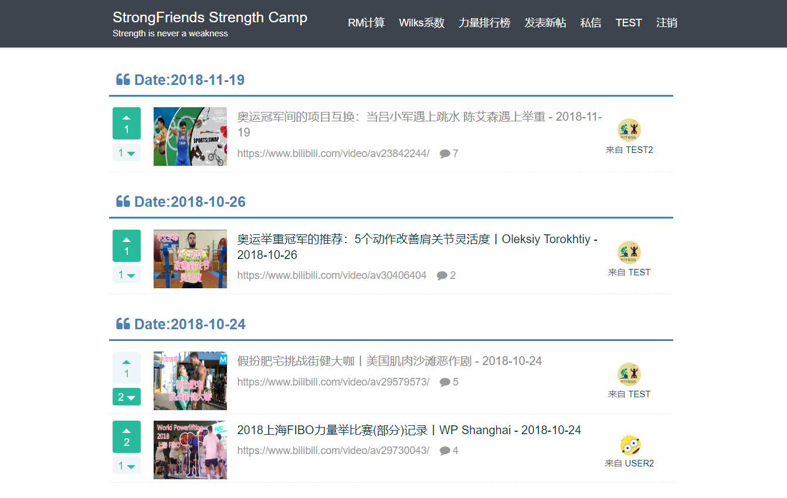
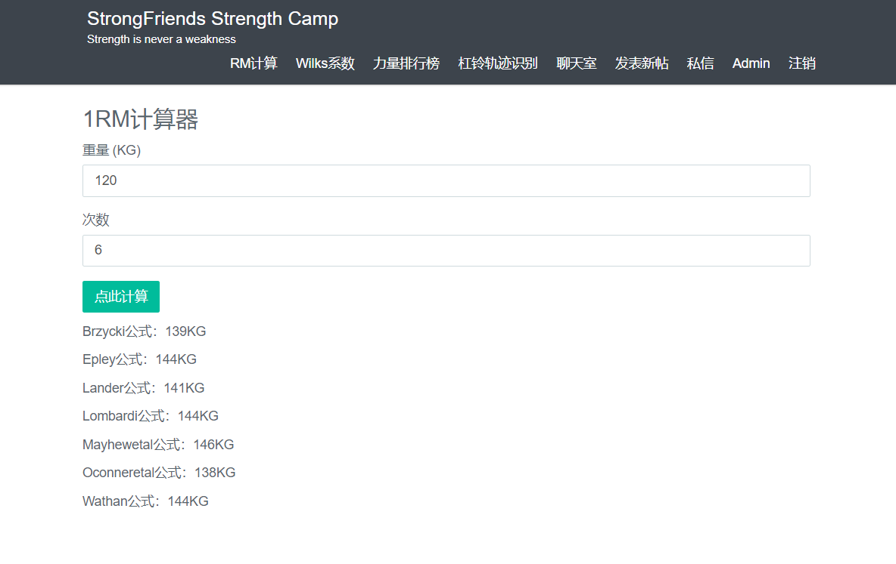
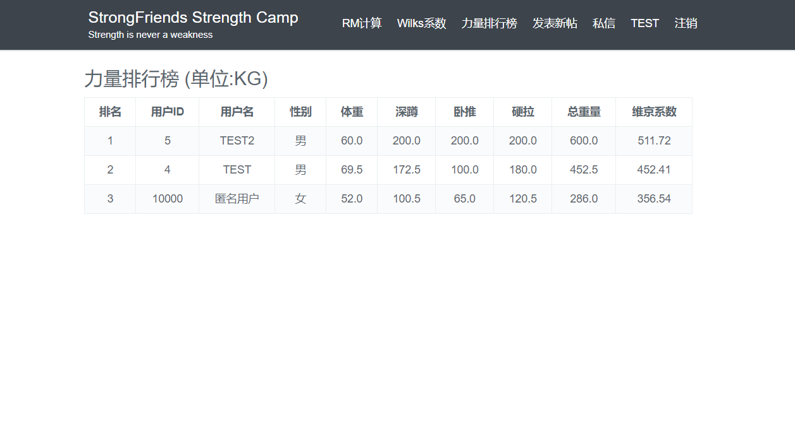
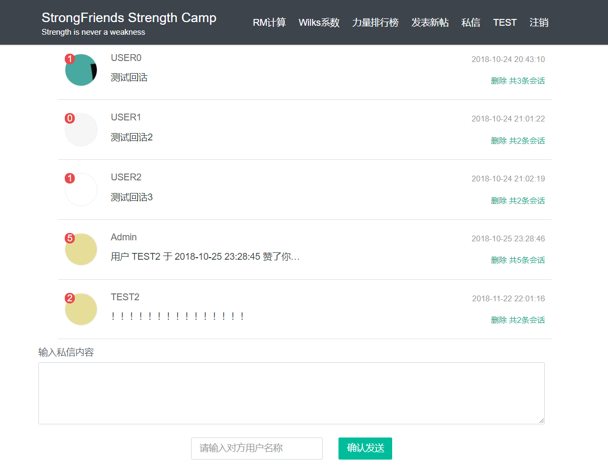
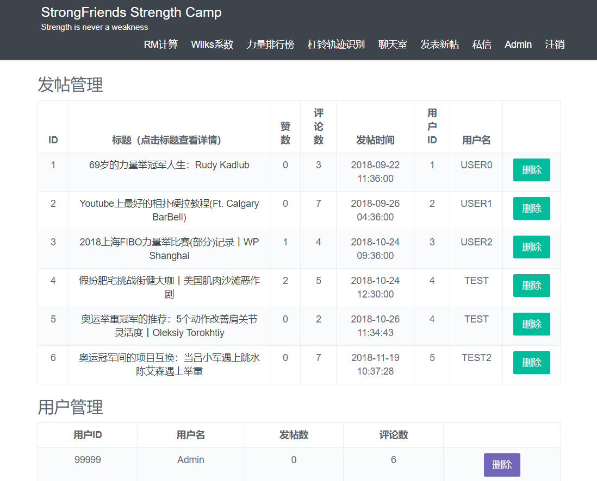

# StrongFriends

## About StrongFriends
StrongFriends is a form which focus on the lifting. You can share information you are interested in by sending posts and communicate with others via comment or letter. We also provide RM(Repetition Maximum) and Wilks coefficient calculator. In the strength rankings you will see other user's training level.
## Development Environment
- JDK1.8
- Maven
- Spring Boot
- MyBatis
- Velocity
- MySQL
- Redis

## Notes
### Register
To improve user's safe level, I add random salt to the password and encrypt/decrypt the password with MD5.

### Interceptor
I use Interceptor in login and access control. Once user have registered, service will generate a token and save it to MySQL database. When user have login successfully, server will add token's value to cookie in response. Next the user click other page, preHandler() function will check the cookie for the existence of token, if the tokens value equal to databse's value, this user's info will be saved to ThreadLocal.

### Filter
1. Implementing `XssHttpServletRequestWrapper` class which is extends from  `HttpServletRequestWrapper`, then override `getParameter()` and `getParameterValues()` method. Escape all request's param and JSON by using `org.apache.commons.lang3` library's `StringEscapeUtils.escapeHtml4()` method.

2. Use Fliter to flite all requests and cast `HttpServletRequest` to `XssHttpServletRequestWrapper`.

### Redis
I only use Redis in like/dislie and comment service.

Like/Dislike:
Write: Redis
Read: Redis
PS: Considering Like and dislike data is hot spot data, So just write it regularly into MySQL will be fine.

Comment:
Write: Write to MySQl and remove Redis cache behind
Read: Read from Redis, if the data was cached before, return it.If not, server will retrieves the data from MySQl and add it to Redis.

### Async Module

To implent async module, I maintain a blocking queue by using Redis. Some user's requests like letter, comment, like/dislike will be handled in async way.

This async module is designed based on producer/consumer model, it can divided into the following five classes:
- EventModel (Event class)
- EventType (This class marks the type of events)
- EventHandler (A common class to handle events)
- EventProducer (Every single request will be pushed to the queue)
- EventConsumer (Consumer will generate a thread pool to consume the events in the queue with infinite loop.)

## Screenshot

