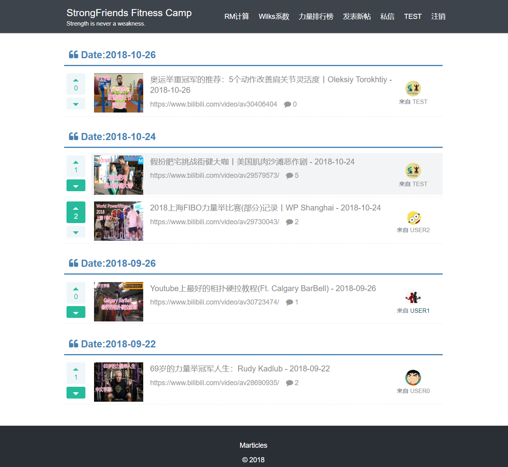

# StrongFriends

## About StrongFriends
StrongFriends is a form which focus on the lifting. You can share information you are interested in by sending posts and communicate with others via comment or letter. We also provide RM(Repetition Maximum) and Wilks coefficient calculator. In the strength rankings you will see other user's training level.
## Development Environment
- JDK1.8
- Maven
- Spring Boot
- MyBatis
- Velocity
- MySQL
- Redis

## Notes
### Register
To improve user's safe level, I add random salt to the password and encrypt/decrypt the password with MD5.

### Interceptor
I only use Interceptor in login. Once user have registered, service will generate a "ticket" and save it to MySQL database. When user have login successfully, server will add ticket's value to cookie in response. Next the user click other page, preHandler() function will check the cookie for the existence of "ticket", if the "ticket"'s value equal to databse's value, this user will save to the ThreadLocal.

### Why I use Redis
In order to take release the pressure of the servers, I maintain a blocking queue by using Redis. Some user's requests like letter, comment, like/dislike will be handled in async way.

### Async Module
This async module is designed based on producer/consumer model, it can divided into the following five classes:
- EventModel (Event class)
- EventType (This class marks the type of events)
- EventHandler (A common class to handle events)
- EventProducer (Every single request will be pushed to the queue)
- EventConsumer (Consumer will generate a thread pool to consume the events in the queue with infinite loop.)